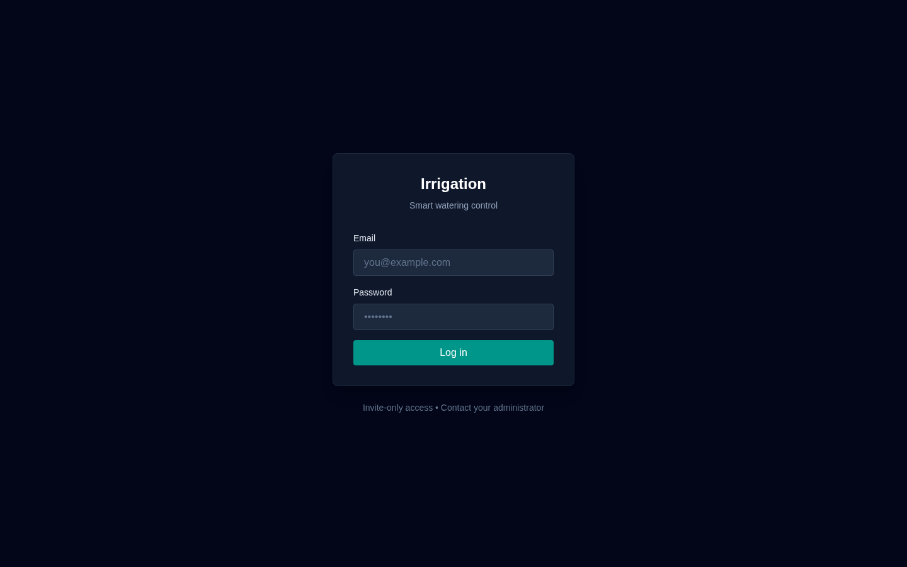
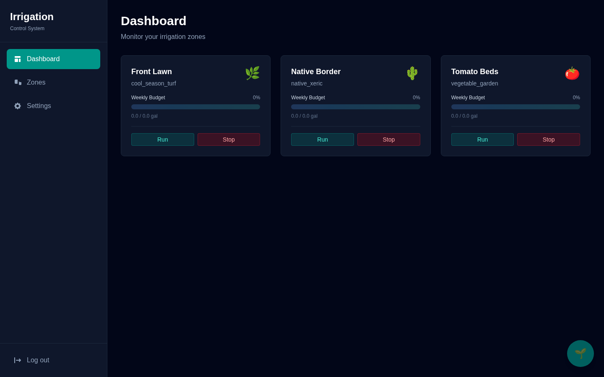
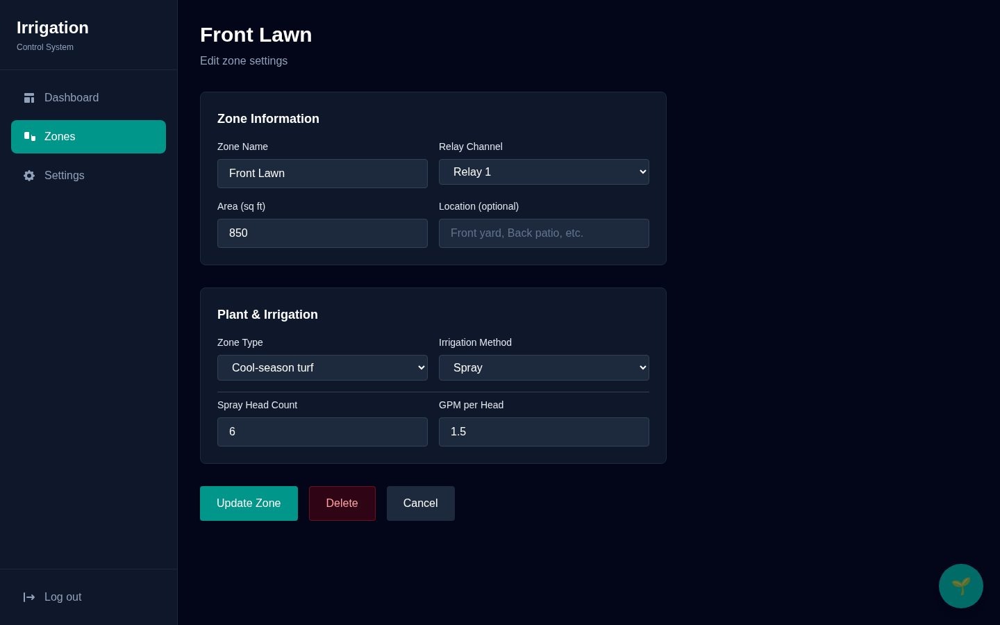
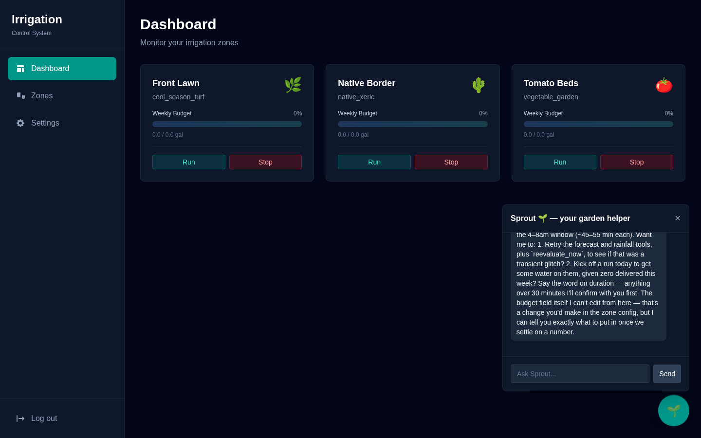

# 🌱 Irrigation

A personal smart-irrigation system: a 16-channel relay board in the yard, a serverless-ish AWS backend, a weather-aware watering scheduler, and **Sprout** — an AI garden assistant that can explain (and control) everything over chat.

| Login | Dashboard |
|---|---|
|  |  |

| Zone editor | Sprout, the AI garden helper |
|---|---|
|  |  |

## How it works

```
KinCony KC868-E16P (ESP32, 16 relays, PoE)
        │  MQTT over mutual TLS
        ▼
   AWS IoT Core ◄── HTTPS publish ──┐
                                    │
CloudFront ── ALB ── ECS Fargate [Next.js app + in-process scheduler]
                                    │
              DynamoDB (state) · S3+Athena (irrigation log) · Cognito (invite-only auth)
                                    │
                    Tomorrow.io forecast · optional Tempest rain gauge
                                    │
                        Bedrock (Claude) — "Sprout" chat + tools
```

- **Zones** map to relay channels. Each zone describes its plants (turf / vegetables / shrubs / xeric / trees) and irrigation hardware (drip emitters, spray heads, soaker hose), which computes a **gallons-per-week budget** (EPA WaterSense-style depth tables × 0.623 gal/sqft-inch).
- The **hourly scheduler** offsets the budget by measured rainfall, checks the forecast, and applies rain-skip / wind / freeze gates before scheduling runs in the 4–8 am window (zones never overlap; runs cap at 55 min).
- The **minute executor** opens/closes valves over IoT Core with an atomic run-state machine (PENDING → ACTIVE → COMPLETED, conditional writes) and credits actually-delivered gallons.
- **Defense in depth**: the firmware itself force-closes any relay after 60 minutes, and the app force-closes all 16 relays on startup — a crashed container can never leave a valve open.
- Every decision (RAN / SKIPPED / REDUCED / DELAYED / FAILED, with a human-readable reason) is logged as JSONL to S3 and queryable via Athena partition projection.
- **Sprout** (Claude on Bedrock via the `AnthropicBedrockMantle` client) has real tools: zone status, forecast, rainfall, history queries, run/stop valves (same safety paths as the buttons), and re-evaluation.

## Repo layout

```
firmware/   ESPHome config for the KC868-E16P (ESP-IDF, MQTT mTLS, dual OTA, relay failsafes)
infra/      AWS CDK stack — Cognito, DynamoDB, S3+Glue/Athena, IoT Core, ECS/ALB/CloudFront, IAM
cloud/      Next.js app — dashboard, scheduler jobs, weather providers, Bedrock chat
docs/       Screenshots
```

## Deploying

1. **Infra**: `cd infra && npm i && npx cdk deploy`, then follow `infra/README.md` for the one-time manual steps (IoT device certificate, app access key, inviting yourself via Cognito).
2. **Firmware**: copy `firmware/secrets.yaml.example` → `secrets.yaml`, fill in the IoT endpoint + certs, then `esphome run firmware/kc868-e16p.yaml`.
3. **Cloud**: copy `cloud/.env.example` → `.env`, fill values from the stack outputs, then either
   - `docker compose up -d` (self-hosted / Unraid), or
   - push the image to ECR — the CDK stack runs it on Fargate behind CloudFront.

## Hard-won field notes (AWS IoT + ESPHome)

Three non-obvious things this repo already accounts for, so you don't have to rediscover them:

1. **`iot:RetainPublish` is a separate IAM action** — ESPHome's birth/last-will status is retained, and without this permission AWS IoT silently closes the connection before CONNACK.
2. **ESPHome's `discover_ip` (default on) subscribes at QoS 2** — AWS IoT doesn't support QoS 2 and drops the connection. `discover_ip: false` is required.
3. **Next.js bundles `instrumentation.ts` for the Edge runtime too** — top-level imports of anything touching `node:crypto` (like the AWS SDK) crash the container at boot. All app imports there are dynamic, inside the `NEXT_RUNTIME === "nodejs"` guard.

---

Built with [Claude Code](https://claude.com/claude-code).
